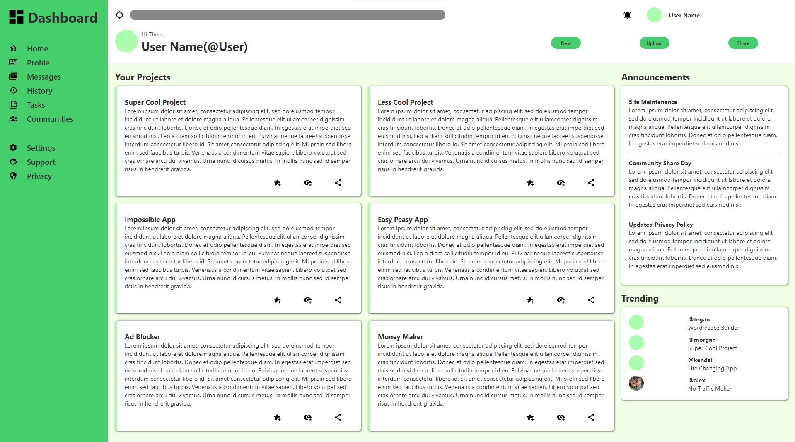

# Odin-Admin-Dashboard

## Overview

The Admin Dashboard is the final project from the Intermediate HTML and CSS course from the Odin Project. 

The main purpose of this project is to use the grid layout tools that were covered in the previous lessons. Therefore, I have only used grid in the layout.

We were provided an example layout, which I have tried to stick to, with changes made to the icons and color scheme.

### Provided Example Layout 

### My Implementation

## Features

- Icons have been downloaded and placed in the icons folder, on hover an invert filter flips the color from black to white.
- Implements a 100% grid layout.
- Replicates the example layout.

## Usage

To see a live demonstration of the Admin Dashboard, please follow the following link: [Odin-Admin-Dashboard](https://ogmui.github.io/Odin-Admin-Dashboard/).

## Acknowledgements

- Icons were downloaded from [Pictogrammers](https://pictogrammers.com/library/mdi/).
- This project is part of The Odin Project's Intermediate HTML and CSS Course. Many thanks to the team behind this course for making the journey into web development accessible.
